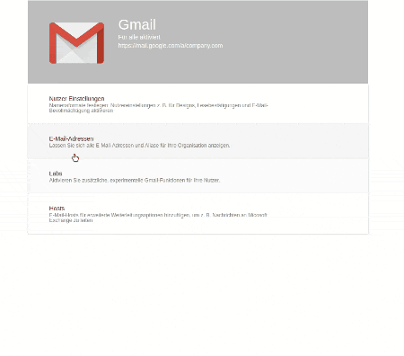

# Material Settings Panel

[](https://travis-ci.org/TeamWertarbyte/material-ui-settings-panel)
[](https://greenkeeper.io/)

[](https://nodei.co/npm/material-ui-settings-panel/)

A settings component in material ui style inspired by google admin console and google inbox. 
See [the storybook](https://teamwertarbyte.github.io/material-ui-settings-panel) for an interactive demo.



## Installation
```shell
npm i --save material-ui-settings-panel
```

## Usage

```js
import { 
  ExpandablePanel, 
  HeaderPanel, 
  SettingsGroup, 
  SettingsItem, 
  SettingsPanel
} from 'material-ui-settings-panel'

// ...

render() {
  return (
    <div>
        <SettingsPanel>
          <HeaderPanel
            title="Gmail"
            subtitle="Für alle aktiviert"
            description="https://mail.google.com/a/company.com"
            image={}
          />
          <ExpandablePanel
            title="Nutzer Einstellungen"
            description="Sed diam nonumy eirmod tempor invidunt ut labore"
          >
            <SettingsGroup title="Lorem ipsum">
              <SettingsItem title="Lorem ipsum" description="Description">
                <div>
                  Lorem ipsum dolor sit amet, consetetur sadipscing elitr, 
                  sed diam nonumy eirmod tempor invidunt ut labore
                  et dolore magna aliquyam erat, sed diam voluptua.
                </div>
              </SettingsItem>
              <SettingsItem title="Lorem ipsum">
                <div>
                  Lorem ipsum dolor sit amet, consetetur sadipscing elitr, 
                  sed diam nonumy eirmod tempor invidunt ut labore
                  et dolore magna aliquyam erat, sed diam voluptua.
                </div>
              </SettingsItem>
            </SettingsGroup>
          </ExpandablePanel>
          <ExpandablePanel
            title="E-Mail-Adressen"
            description="Lassen Sie sich alle E-Mail-Adressen und Aliase für Ihre Organisation anzeigen."
          >
          </ExpandablePanel>
        </SettingsPanel>
    </div>
  )
}
```

### SettingsPanel Properties

|Name            |Type        |Default     |Description
|----------------|------------|------------|--------------------------------
|style           | `object`   |            | Override the inline-styles of the root component.

### HeaderPanel Properties

|Name                   |Type       |Default      |Description
|-----------------------|-----------|-------------|--------------------------------
|description            | `string`  |             | Description for the header.
|image                  | `node`    |             | Image for the header.
|imageStyle             | `object`  |             | Override the inline-styles of the image container.
|style                  | `object`  |             | Override the inline-styles of the root component.
|subtitle               | `string`  |             | Subtitle for the header.
|textStyle              | `object`  |             | Override the inline-styles of the text container.
|title*                 | `string`  |             | Title for the header.

### ExpandablePanel Properties

|Name                   |Type       |Default      |Description
|-----------------------|-----------|-------------|--------------------------------
|description            | `string`  |             | Description for the panel.
|style                  | `object`  |             | Override the inline-styles of the root component.
|textStyle              | `object`  |             | Override the inline-styles of the text container.
|title*                 | `string`  |             | Title for the panel.

### SettingsGroup Properties

|Name                   |Type       |Default      |Description
|-----------------------|-----------|-------------|--------------------------------
|style                  | `object`  |             | Override the inline-styles of the root component.
|title*                 | `string`  |             | Title for the group.


### SettingsItem Properties

|Name                   |Type       |Default      |Description
|-----------------------|-----------|-------------|--------------------------------
|description            | `string`  |             | Description for the panel.
|style                  | `object`  |             | Override the inline-styles of the root component.
|title*                 | `string`  |             | Title for the panel.

\* required property

## License

The files included in this repository are licensed under the MIT license.
